<!-- =========================================================
     GITHUB PROFILE README
     Author: Janith Dasanayaka
========================================================= -->

 

 

## 👋 About Me

I'm a Software Engineering student and full-stack developer focused on building practical web, enterprise, and business management applications.

I work primarily with the **Java and Spring Boot** ecosystem and the **MERN and Next.js** stack. I am also expanding my knowledge in **Flutter mobile development, DevOps, containerization, CI/CD, Linux, and cloud deployment**.

* 🎓 Studying **Software Engineering**
* 💻 Building full-stack web and enterprise applications
* ☕ Developing applications with **Java and Spring Boot**
* 🌐 Working with **React, Next.js, Node.js, Express, and MongoDB**
* 📱 Exploring mobile application development with **Dart and Flutter**
* ⚙️ Learning **DevOps, deployment automation, and cloud computing**
* 🐳 Practising **Docker, Docker Compose, Linux, and GitHub Actions**
* ☁️ Developing my knowledge of **AWS and cloud deployment**
* 🤖 Integrating **AI APIs** into real-world business applications
* 🌴 Building systems for tourism, education, and business management
* 📸 Interested in photography, editing, and visual storytelling
* 🎯 Currently pursuing a **Software Engineering internship**

 

## 🛠️ Tech Stack

### Languages & Web Fundamentals

  

### Frontend & Mobile Development

  

### Backend & Enterprise Development

  

### Databases

  

### DevOps, Cloud & Deployment

  

### Development Tools

 

## ⚙️ DevOps Journey

<table align="center">
<tr>
<td valign="top" width="50%">

### Version Control

* Git and GitHub
* Branching workflows
* Pull requests
* Merge conflict resolution
* Collaborative development

### Operating Systems

* Linux fundamentals
* Command-line navigation
* Bash scripting
* PowerShell
* Environment configuration

### Containerization

* Docker fundamentals
* Docker images and containers
* Dockerfiles
* Docker Compose
* Container registries

</td>
<td valign="top" width="50%">

### CI/CD

* GitHub Actions
* Automated builds
* Automated testing
* Deployment pipelines
* Workflow configuration

### Servers & Deployment

* Nginx
* Reverse proxy configuration
* Environment variables
* Application deployment
* Vercel deployment

### Cloud

* AWS fundamentals
* Cloud deployment concepts
* Application hosting
* Cloud environment configuration

</td>
</tr>
</table>

### Next Learning Targets

`Kubernetes` · `Terraform` · `Monitoring` · `Logging` · `Infrastructure as Code`

 

## 📊 GitHub Statistics

<!--
These cards are generated by:
.github/workflows/stats.yml

Run the workflow once after adding it to create the SVG files.
-->

 

## 🐍 Contribution Activity

<picture>
  <source
    media="(prefers-color-scheme: dark)"
    srcset="https://raw.githubusercontent.com/janithcd/janithcd/output/github-contribution-grid-snake-dark.svg"
  />

<source
 media="(prefers-color-scheme: light)"
 srcset="https://raw.githubusercontent.com/janithcd/janithcd/output/github-contribution-grid-snake.svg"
/>

 </picture>

 

## 📚 Currently Learning

| Area               | Current Focus                                       |
| ------------------ | --------------------------------------------------- |
| Backend            | Advanced Spring Boot, Java and REST API development |
| Frontend           | TypeScript, React and Next.js                       |
| Mobile             | Dart and Flutter application development            |
| DevOps             | Docker, CI/CD and GitHub Actions                    |
| Cloud              | AWS fundamentals and application deployment         |
| Databases          | MongoDB and MySQL optimization                      |
| AI                 | AI API integration into business applications       |
| Testing            | Unit, integration and performance testing           |
| Project Management | Google Project Management Professional Certificate  |

 

## 🎯 Current Goals

* Complete my Software Engineering degree
* Secure a Software Engineering internship
* Build production-ready portfolio projects
* Strengthen my Java and Spring Boot knowledge
* Improve my React, Next.js and TypeScript skills
* Build mobile applications using Flutter
* Gain practical experience with Docker and CI/CD
* Deploy full-stack applications to the cloud
* Contribute to open-source projects
* Learn Kubernetes and Infrastructure as Code

 

## 💡 Areas of Interest

 

## 🤝 Connect With Me

 

### “Learn continuously, build purposefully, and improve every day.”

⭐ Thanks for visiting my profile!

